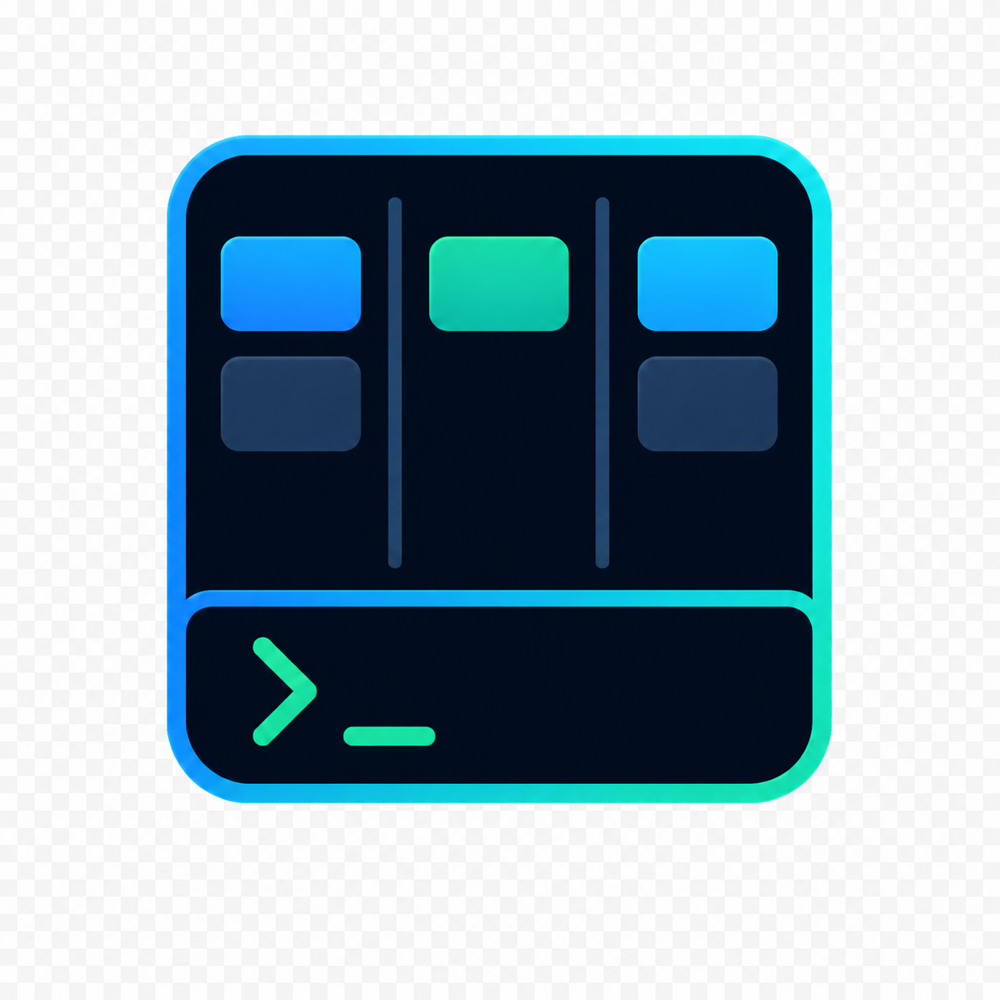
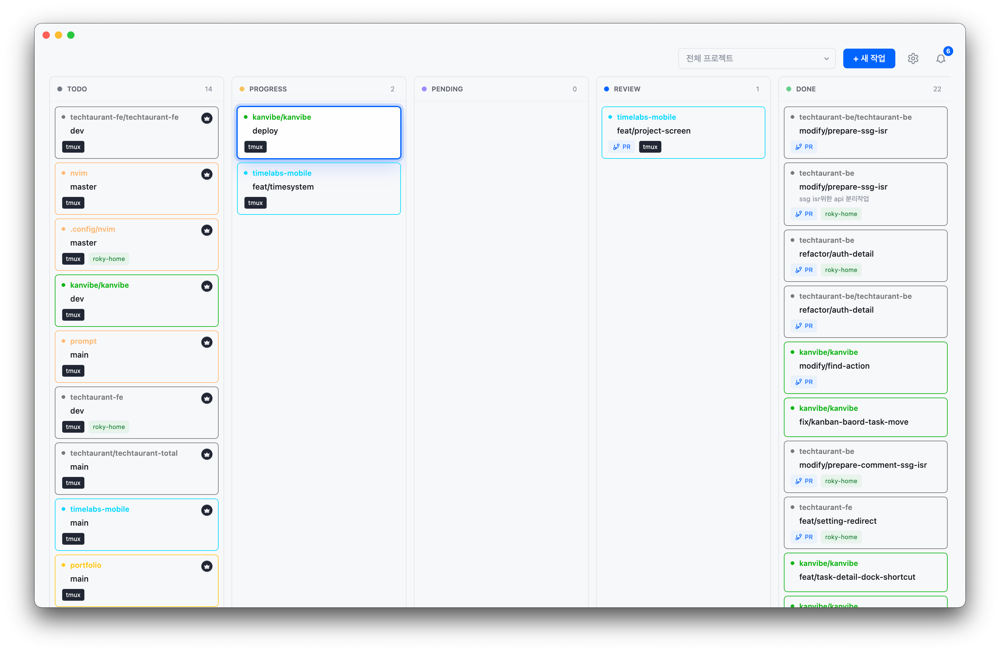
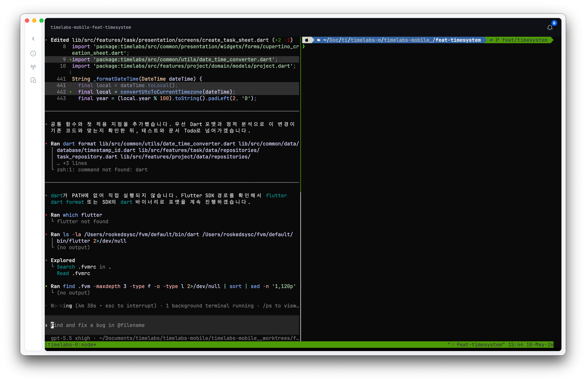
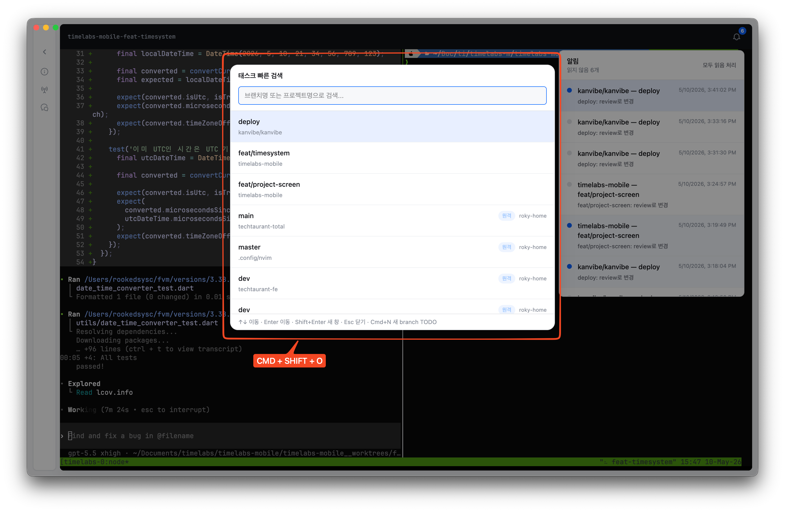
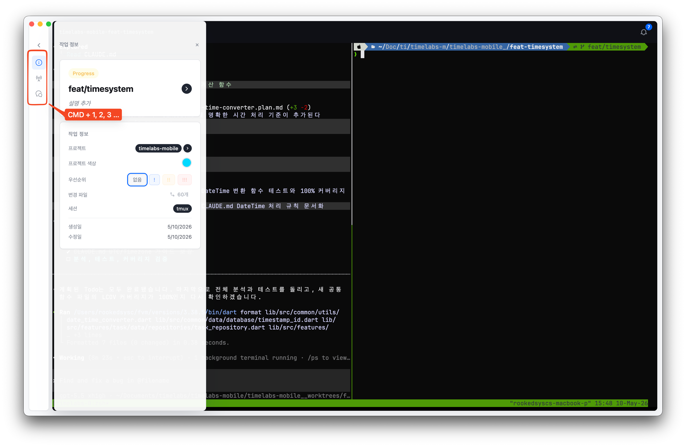
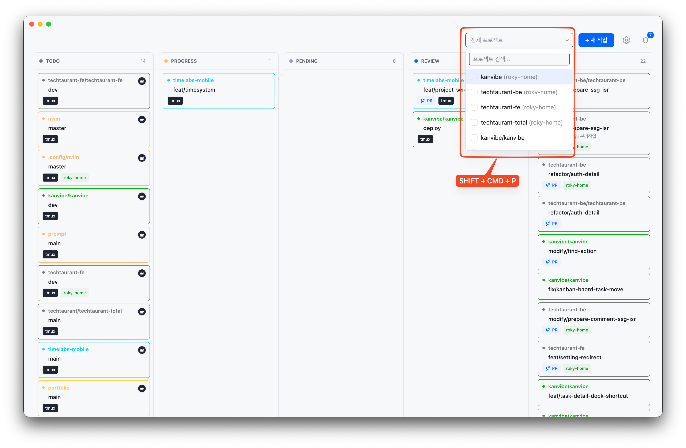
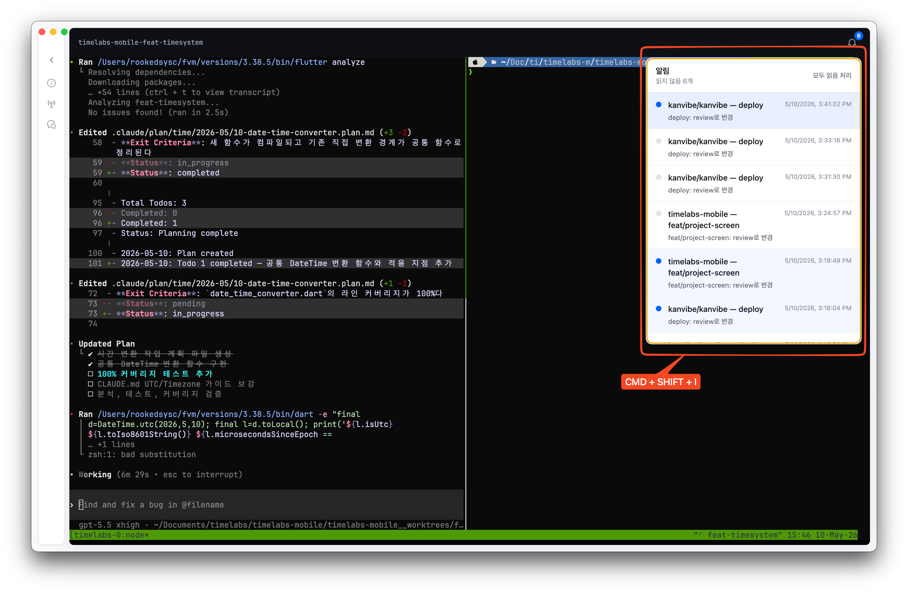
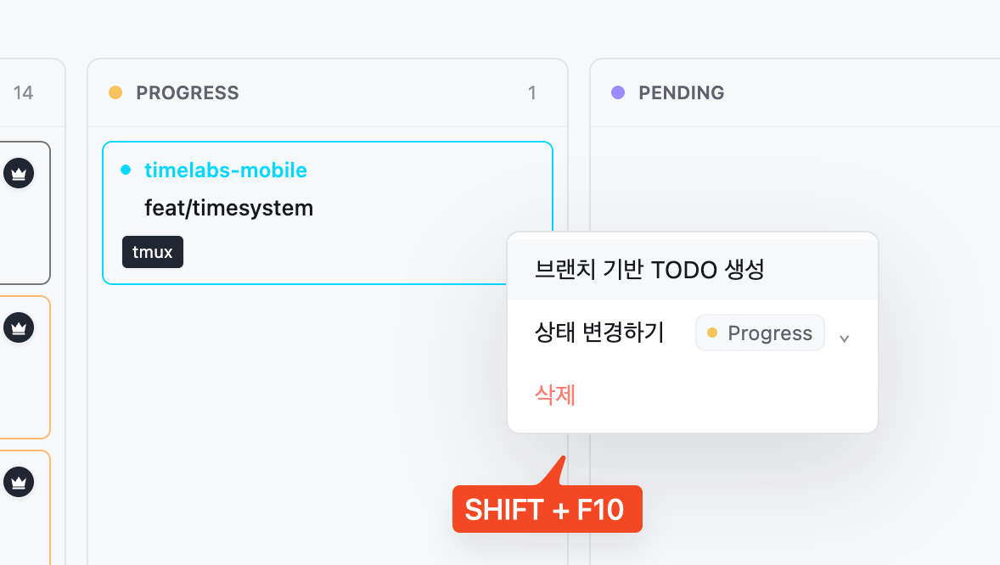

<div align="center">



# KanVibe

**Keyboard-first Kanban workspace for AI coding agents**

KanVibe keeps AI coding work out of scattered terminal tabs. Track branch-based tasks on a real-time Kanban board, open each task's tmux/zellij session in the browser or desktop app, and let Claude Code, Gemini CLI, Codex CLI, and OpenCode hooks move tasks through the workflow automatically.

Use shortcuts for project filters, task search, notifications, task detail panels, and common task actions without losing terminal focus.

[](https://buymeacoffee.com/rookedsysc)

> Buying me a coffee is nice, but honestly? A contribution would make my day even more. :)

[KO](./docs/README.ko.md) | [ZH](./docs/README.zh.md)

</div>

<div align="center">

<table>
  <tr>
    <td width="50%">
      
      <br>
      <strong>Main Kanban board</strong>
    </td>
    <td width="50%">
      
      <br>
      <strong>Task detail workspace</strong>
    </td>
  </tr>
</table>

<iframe
  width="100%"
  height="480"
  src="https://www.youtube.com/embed/8JTrvd3T_Z0"
  title="KanVibe demo"
  frameborder="0"
  allow="accelerometer; autoplay; clipboard-write; encrypted-media; gyroscope; picture-in-picture; web-share"
  allowfullscreen>
</iframe>

**[Watch Demo on YouTube](https://www.youtube.com/watch?v=8JTrvd3T_Z0)**

</div>

---

## Key Workflows

### 1. Quick Task Search

Open task search from anywhere, filter by project or branch name, and jump directly into the task workspace without returning to the board first.



### 2. Task Detail Shortcuts

Use numbered dock shortcuts on a task detail page to open task metadata, hook status, AI chat, and PR actions before the keystroke reaches the embedded terminal.



### 3. Project Filter

Narrow the board to the active projects you care about, with keyboard navigation for switching between repositories quickly.



### 4. Notifications

Open the notification panel to review AI agent status changes, background sync results, and task events, then jump to the related task.



### 5. Quick Task Actions

Create follow-up branch TODOs directly from the highlighted search result, preserving project and branch context for the next piece of work.



---

## Prerequisites

| Dependency | Version | Required | Install |
|------------|---------|----------|---------|
| [git](https://git-scm.com/) | latest | Yes | `brew install git` |
| [tmux](https://github.com/tmux/tmux) | latest | Yes | `brew install tmux` |
| [gh](https://cli.github.com/) | latest | Yes | `brew install gh` (requires `gh auth login`) |
| [zellij](https://github.com/zellij-org/zellij) | latest | No | `brew install zellij` |

---

## Quick Start

### Install with Homebrew

Until KanVibe is accepted into the official Homebrew Cask repository, install it from the KanVibe Homebrew tap:

```bash
brew install --cask rookedsysc/kanvibe/kanvibe
open -a KanVibe
```

After the official Homebrew Cask is accepted, the install command becomes:

```bash
brew install --cask kanvibe
```

### Update or Remove

```bash
brew update
brew upgrade --cask kanvibe
```

```bash
brew uninstall --cask kanvibe
brew untap rookedsysc/kanvibe
```

---

## Usage Flow

### 1. Register a Project

Search for your local git repository using the **fzf-style folder search** in project settings. KanVibe scans the directory and automatically detects existing worktree branches.

To stop managing a project, delete it from project settings. This removes the project and its KanVibe tasks from the embedded SQLite database only; git branches, worktrees, and files on disk are kept.

### 2. Create Tasks

Add a TODO task from the Kanban board. When creating a task with a branch name, KanVibe automatically:
- Creates a **git worktree** for the branch
- Spawns a **tmux window** or **zellij tab** for the session
- Links the terminal session to the task

### 3. Work with the Kanban Board

Tasks are managed through 5 statuses: **TODO** → **PROGRESS** → **PENDING** → **REVIEW** → **DONE**

Change statuses via drag & drop, or let [AI Agent Hooks](#ai-agent-hooks---automatic-status-tracking) transition them automatically. When a task moves to **DONE**, its branch, worktree, and terminal session are **automatically deleted**.

### 4. Select Pane Layouts

Each task's terminal page supports multiple pane layouts:

| Layout | Description |
|--------|-------------|
| **Single** | One full-screen pane |
| **Horizontal 2** | Two panes side by side |
| **Vertical 2** | Two panes stacked |
| **Left + Right TB** | Left pane + right top/bottom split |
| **Left TB + Right** | Left top/bottom split + right pane |
| **Quad** | Four equal panes |

Each pane can run a custom command (e.g., `vim`, `htop`, `lazygit`, test runner, etc.). Configure layouts globally or per-project from the settings dialog.

---

## Features

### Real-Time Kanban Board
- 5-status task management (TODO / PROGRESS / PENDING / REVIEW / DONE)
- Drag & drop task ordering with project colors, priority markers, PR badges, and session labels
- Multi-project filtering with keyboard search for visible project and task text
- Done column pagination for long-running projects
- Real-time WebSocket updates across browser and desktop windows

### Branch-Based Task Workspace
- Create branch TODOs that automatically prepare a git worktree and terminal session
- Scan existing worktree branches and register them as TODO tasks
- Open each task into a dedicated terminal workspace with task metadata, hook controls, chat, and PR actions in the side dock
- Move a task to DONE to clean up its branch, worktree, and terminal session automatically
- Delete a project from settings without touching existing git branches, worktrees, or files on disk

### Terminal Sessions (tmux / zellij)
- **tmux** and **zellij** are both supported as terminal multiplexers
- Browser-based terminal streaming through xterm.js and WebSocket
- SSH remote terminal support that reads `~/.ssh/config`
- Non-interactive remote SSH commands reuse an app-local ControlMaster socket pool under `~/.kanvibe`, with per-host concurrency capped at 4x available CPU cores
- Remote terminal attach executes tmux/zellij directly over SSH; trusted X11 forwarding (`ssh -Y`) is requested only when local `DISPLAY`, remote `X11Forwarding`, and `xauth` are available
- Nerd Font rendering support

### Keyboard-First Controls
- Open quick task search by branch or project name from anywhere
- Filter projects, inspect notifications, and trigger task actions without leaving the board
- Use numbered detail shortcuts to switch task info, status/hooks, AI chat, PR, and other dock panels before keystrokes reach the terminal
- Create a branch TODO directly from quick search with the configured shortcut

### Keyboard Shortcuts

| Shortcut | Scope | Action |
|----------|-------|--------|
| `Cmd/Ctrl+F` | Board | Open page find for visible project/task text |
| `Cmd/Ctrl+Shift+O` | Global | Open quick task search by branch or project name (default, configurable) |
| `Cmd/Ctrl+Shift+P` | Board | Open the project filter dropdown |
| `Cmd/Ctrl+Shift+I` | Board | Open the notifications dropdown |
| `Cmd+[` / `Cmd+]` (macOS), `Alt+[` / `Alt+]` (Linux) | Global | Navigate back/forward through app history; back falls back to board home when there is no previous page |
| `Cmd+1/2/3` (macOS), `Alt+1/2/3` (Linux) | Task detail | Activate the numbered detail dock items: info, status/hooks, and AI chat. These shortcuts are intercepted before terminal input |
| `Cmd+4` (macOS), `Alt+4` (Linux) | Task detail | Open the task PR in the browser when a PR exists; otherwise the shortcut belongs to the fourth numbered dock item when present |
| `Cmd/Ctrl+N` | Quick task search | Create a new branch TODO from the currently highlighted task |
| `↑ / ↓ / Enter / Shift+Enter / Esc` | Quick task search | Move selection, open task, open task in a new window, close dialog |
| `↑ / ↓ / Enter / Esc` | Project filter dropdown | Move selection, toggle project filter, close dropdown |
| `↑ / ↓ / Enter / Esc` | Notifications dropdown | Move selection, open notification target, close dropdown |

Task detail dock numbering excludes the back-to-board button and follows the visible dock item order. If a task has a PR URL, PR takes slot 4 and later dock items shift to 5+; without a PR, the next dock item uses slot 4.

### AI Agent Hooks - Automatic Status Tracking
KanVibe integrates with **Claude Code Hooks**, **Gemini CLI Hooks**, **Codex CLI**, and **OpenCode** to automatically track task status. Tasks are managed through 5 statuses:

| Status | Description |
|--------|-------------|
| **TODO** | Initial state when a task is created |
| **PROGRESS** | AI is actively working on the task |
| **PENDING** | AI asked a follow-up question; waiting for user response (Claude Code only) |
| **REVIEW** | AI has finished; awaiting review |
| **DONE** | Task complete — branch, worktree, and terminal session are **automatically deleted** |

#### Claude Code
```
User sends prompt          → PROGRESS
AI asks question (AskUser) → PENDING
User answers               → PROGRESS
AI finishes response       → REVIEW
```

#### Gemini CLI
```
BeforeAgent (user prompt)  → PROGRESS
AfterAgent (agent done)    → REVIEW
```

> Gemini CLI does not have an equivalent to Claude Code's `AskUserQuestion`, so the PENDING state is not available.

#### Codex CLI
```
UserPromptSubmit                → PROGRESS
PermissionRequest (Bash only)  → PENDING
PreToolUse (Bash only)         → PROGRESS
Stop                           → REVIEW
```

KanVibe now uses Codex's current lifecycle hooks model with `.codex/hooks.json` plus both `[features].codex_hooks = true` and `[features].hooks = true` in `.codex/config.toml`:

- https://developers.openai.com/codex/hooks
- https://developers.openai.com/codex/config-reference

> Codex's current `PermissionRequest` and `PreToolUse` matchers are Bash-scoped, so `PENDING` represents approval waits rather than every kind of conversational follow-up question.

#### OpenCode
```
User sends message (message.updated, role=user) → PROGRESS
AI asks a question (question.asked)             → PENDING
User answers question (question.replied)        → PROGRESS
Session idle (session.idle)                     → REVIEW
```

OpenCode uses its own [plugin system](https://opencode.ai/docs/plugins/) instead of shell-script hooks. KanVibe generates a TypeScript plugin at `.opencode/plugins/kanvibe-plugin.ts` that subscribes to OpenCode's native event hooks (`message.updated`, `question.asked`, `question.replied`, and `session.idle`) via the `@opencode-ai/plugin` SDK. This means status updates are handled in-process without spawning external shell commands.

All agent hooks are **auto-installed** when you register a project through KanVibe's directory scan or create a task with a worktree. You can also install them individually from the task detail page.

| Agent | Hook Directory | Config File |
|-------|---------------|-------------|
| Claude Code | `.claude/hooks/` | `.claude/settings.json` |
| Gemini CLI | `.gemini/hooks/` | `.gemini/settings.json` |
| Codex CLI | `.codex/hooks/` | `.codex/config.toml`, `.codex/hooks.json` |
| OpenCode | `.opencode/plugins/` | Plugin auto-discovery |

#### Browser Notifications

Task status changes via AI Agent Hooks trigger **browser notifications** with project, branch, and status. **Click to jump directly to the task detail page.**

- **Real-time alerts** — Instant notifications for task status changes
- **Background mode** — Notifications work even when KanVibe is not focused
- **Smart navigation** — Click notification → task detail page (with correct language)
- **Configurable** — Enable/disable per project and filter by status (PROGRESS, PENDING, REVIEW, DONE)

Setup: Browser will prompt for permission on first visit. Configure filters in **Project Settings** → **Notifications**.

#### Hook API Endpoints

| Endpoint | Method | Description |
|----------|--------|-------------|
| `/api/hooks/start` | POST | Create a new task |
| `/api/hooks/status` | POST | Update task status by `branchName` + `projectName`; if the target is missing, KanVibe still sends a browser notification and returns `404` without changing status |

### GitHub-style Diff View

Review code changes directly in the browser with a GitHub-style diff viewer. Click the **Diff** badge on the task detail page to see all modified files compared to the base branch.

- File tree sidebar with changed file count
- Inline diff viewer powered by Monaco Editor
- Edit mode for quick fixes directly in the browser
- Viewed file tracking with checkboxes

### Pane Layout Editor
- 6 layout presets (Single, Horizontal 2, Vertical 2, Left+Right TB, Left TB+Right, Quad)
- Per-pane custom command configuration
- Global and per-project layout settings

### Internationalization (i18n)
- Supported languages: Korean (ko), English (en), Chinese (zh)
- Powered by next-intl

---

## Tech Stack

| Category | Technology |
|----------|------------|
| Frontend/Backend | Next.js 16 (App Router) + React 19 + TypeScript |
| Database | SQLite + TypeORM + better-sqlite3 |
| Styling | Tailwind CSS v4 |
| Terminal | xterm.js + WebSocket + node-pty |
| SSH | system ssh binary |
| Drag & Drop | @hello-pangea/dnd |
| i18n | next-intl |
| Desktop Packaging | Electron + Electron Builder |

---

## License

This project is licensed under the **AGPL-3.0**. You are free to use, modify, and extend it for open-source purposes. Commercial SaaS distribution is not permitted under this license. See [LICENSE](./LICENSE) for details.

---

## Contributing

See [docs/CONTRIBUTING.md](./docs/CONTRIBUTING.md) for guidelines.

---

## Inspired By

- [workmux](https://github.com/raine/workmux) — tmux workspace manager
- [vibe-kanban](https://github.com/BloopAI/vibe-kanban) — AI-powered Kanban board
